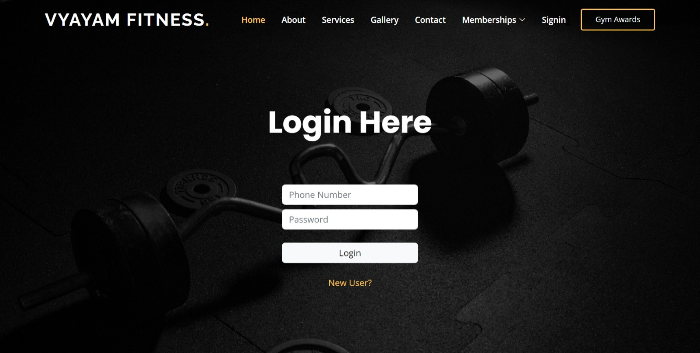

# Vyayam Fitness

## Table of Contents
- [Introduction](#introduction)
- [Features](#features)
- [Database Management](#database-management)
- [Project Structure](#project-structure)
- [Installation](#installation)
- [Screenshots](#screenshots)
- [Contributing](#contributing)
- [License](#license)

## Introduction
Welcome to Vyayam Fitness, a gym website built using Django, HTML, CSS, JavaScript, and SQLite3. This project demonstrates my strong DBMS (Database Management System) skills in designing and implementing an efficient and robust database structure.

## Features
- **User-friendly Interface**: Seamlessly navigate through the website with a clean and intuitive design.
- **Membership**: Enroll in various membership plans and select a dedicated trainer.
- **Gallery**: Explore a stunning collection of gym images that will inspire and motivate.
- **Contact**: Connect with us through the contact form and get your queries answered.
- **Attendance**: Log your workout attendance and track your progress.
- **Profile**: Access your personalized profile to view enrollment details and attendance records.

## Database Management
Vyayam Fitness utilizes SQLite3, a powerful and reliable database management system, for efficient data storage and retrieval. The project showcases my expertise in DBMS by incorporating the following:
- **Database Structure**: The database schema is thoughtfully designed to ensure proper organization and storage of gym-related data, such as user information, enrollment details, gallery images, and attendance records.
- **Data Integrity**: Proper constraints, such as unique and foreign key constraints, are implemented to maintain data integrity and prevent inconsistencies.
- **Data Retrieval**: SQL queries are used to retrieve data based on user requirements, enabling seamless access to relevant information.
- **Data Manipulation**: The project demonstrates my skills in managing database operations, including insertion, modification, and deletion of data through Django's ORM (Object-Relational Mapping).

## Project Structure
The project structure consists of the following directories and files:
- `authapp/`: Contains the main application files, including models, views, templates, and URLs.
- `media/`: Stores uploaded media files, such as gym images.
- `static/`: Holds the static files, including CSS, JavaScript, and vendor libraries.
- `templates/`: Contains HTML templates for different pages of the website.
- `vyayam/`: Includes project-specific configuration files.

## Installation
1. Clone the repository: `git clone https://github.com/shagunsharma14/Vyayam-Fitness.git`
2. Navigate to the project directory: `cd Vyayam-Fitness`
3. Install the required dependencies: `pip install -r requirements.txt`
4. Run database migrations: `python manage.py migrate`
5. Start the development server: `python manage.py runserver`
6. Access the website in your browser at `http://localhost:8000`

## Screenshots

Here's a glimpse of what you can expect from Vyayam Fitness:
- 

- 
     The SignUp page allows users to create an account and join Vyayam Fitness.

-  
     The Login page provides a secure login interface for registered users.

-  
     The Gallery page showcases various images of the gym, giving users a visual tour.

-  
     The ContactUs page allows users to reach out to the gym for any inquiries or feedback.

-  
     The Enrollment page demonstrates the process of enrolling for a membership using an interactive and user-friendly interface. Users can select their desired membership plan and trainer, and provide necessary details for enrollment.

-  
     The Admin page showcases how administrators can access the backend administration panel to manage users, memberships, trainers, and other essential aspects of Vyayam Fitness. It provides a comprehensive and intuitive interface for efficient administration and control.

- 
     The Attendance Data GIF illustrates how attendance records are stored and managed in Vyayam Fitness. It showcases the interface for adding attendance details such as login time, logout time, workout selection, and trainer information.

- 
     The Apply Attendance GIF demonstrates how users can apply for attendance using a simple and straightforward interface. Users can enter their phone number, login time, logout time, select the workout, and choose the trainer to record their attendance.

These screenshots and GIFs provide a visual overview of Vyayam Fitness and its various functionalities.

## Contributing
Contributions are welcome! If you have any suggestions or improvements, feel free to open an issue or submit a pull request.

## License
This project is licensed under the [MIT License](LICENSE).

Let's get fit and stay healthy together at Vyayam Fitness!

---

Created with :heart: by [Shagun Sharma]
